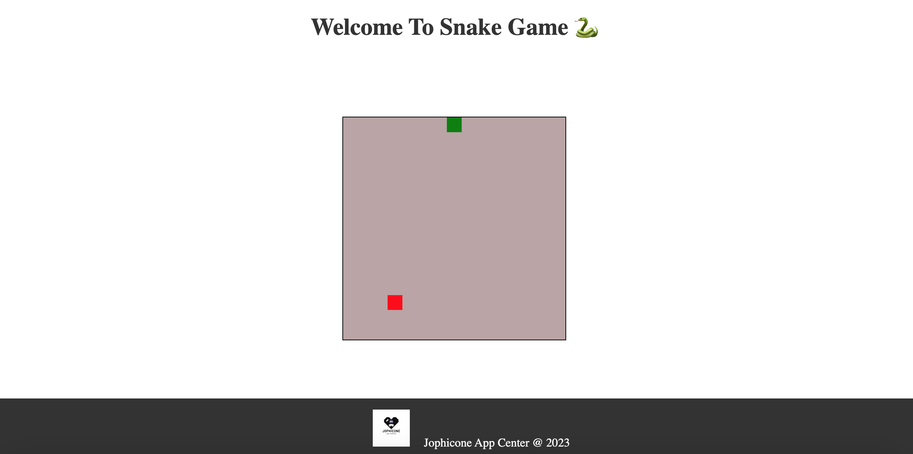

# Snake Game
This is a simple Snake game implemented using HTML, CSS, and JavaScript.

## How to Play
Open the index.html file in a web browser.

Use the arrow keys (Up, Down, Left, Right) to control the snake's movement.

The snake will grow when it eats the red food.

If the snake collides with the walls or itself, the game will reset.
## Screenshots

## Files
index.html: The main HTML file that contains the structure of the game and includes the necessary styles and scripts.

style.css: The CSS file that defines the styles for the game elements.

script.js: The JavaScript file that contains the game logic.

## Customization
Feel free to customize the game by modifying the code in the following ways:

Adjusting the size of the game board and elements in the style section of the index.html file.

Changing the appearance of the snake and food by modifying the styles in the style.css file.

Tweaking the game logic, such as the speed of the snake, in the script.js file.

## Credits
This Snake game is a basic implementation inspired by classic snake games.

## Acknowledgments
Developed by Jofiel Nguyen
Built with HTML, CSS, and JavaScript.

## License
This project is licensed under the MIT License - see the [LICENSE.md](./LICENSE) file for details.

